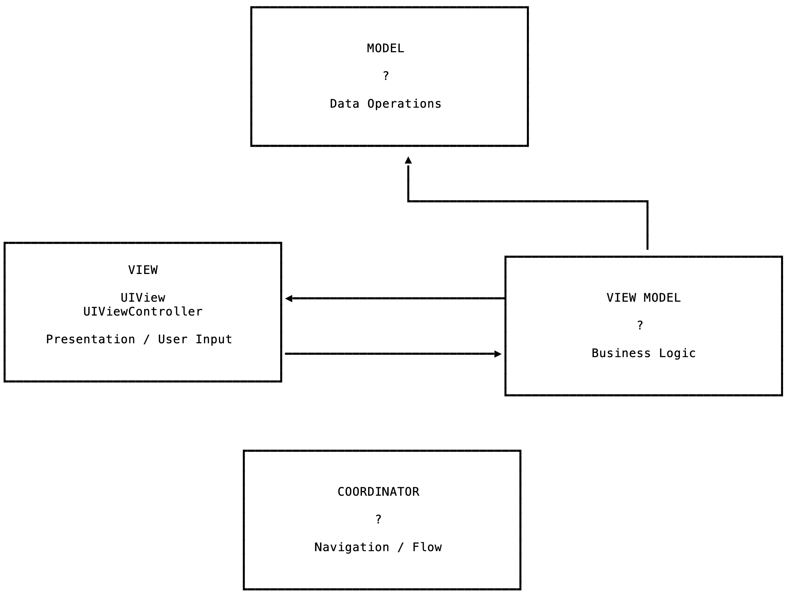

# MVVM-C Sample Code

This is the sample code from talks called MVVM-C in Practice and iOS Archiutecture Tips & Tricks.
It is a demo application using an MVC / MVVM(esque) architectue with [Coordinators](http://khanlou.com/2015/10/coordinators-redux/)

This is a simple archtecture,  with many holes, designed to help people learn how to archirtect code with a good seperation of concerns.
It is not pure MVC or MVVM but takes ideas from each. The implementation of Coordinators borrows heavily from Soroush Khanlou's ideas but also has a number of differences.

This architecture should be used for learnjng some principles rather than something to just use. For simplicity sake there are issues that it just ignores that would need to be handled in any app handling large amounts of data or complex user interactions.

